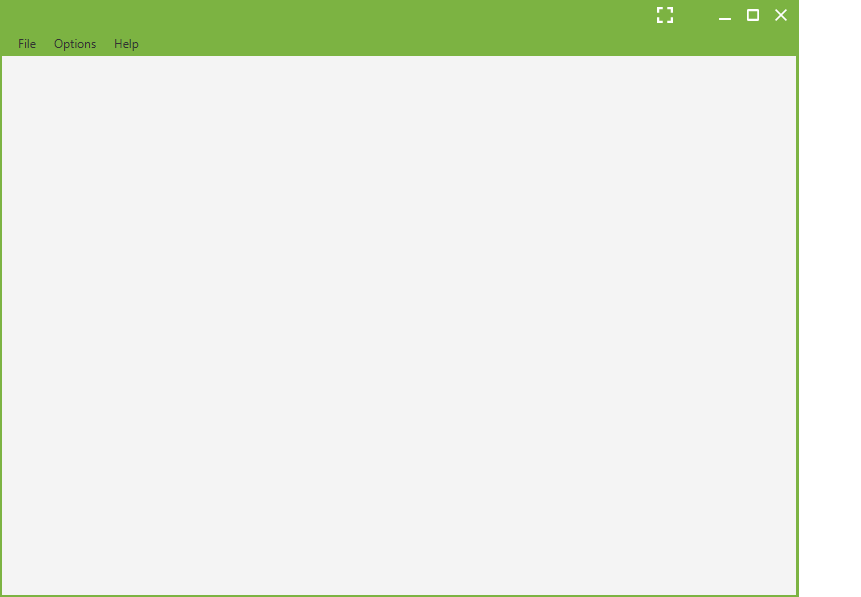

# JMarkPad
Java minimalistic text editor

## General information 

### Installing

To use JMarkPad you only need to download and double click on the executable:

* Download "JMarkPad.jar" if you already have Java 8 installed.
* Download "JMarkPad.zip" if you don't have Java 8 installed. 

[Download the latest version here](https://github.com/mayuso/JMarkPad/releases)

### Roadmap

We are constantly trying to improve JMarkPad, you can see the known bugs and planned enhancements on our [issues list](https://github.com/Edmundtimothy/JMarkPad/issues).

## Development

### Build status 
Develop branch: 

### Versioning

We use [Semantic Versioning 2.0.0](http://semver.org/) for versioning. For the versions available, see the [releases on this repository](https://github.com/mayuso/JMarkPad/releases). 

### Authors

* **Edmundtimothy** - *Initial work* - [Edmundtimothy](https://github.com/Edmundtimothy)

### License

This project is licensed under the Apache License 2.0 - see the [LICENSE.md](LICENSE.md) file for details
